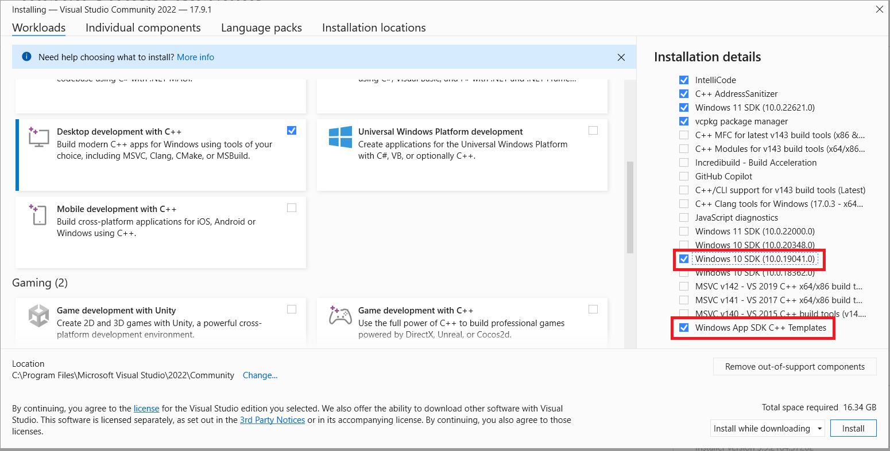

# LINE Planet Call for Windows

LINE Planet Call is a demo app for LINE Planet, a cloud-based real-time communications platform as a service (CPaaS).

LINE Planet Call showcases the key features of LINE Planet, including 1-to-1 and group call functionalities. It can help you understand how to integrate LINE Planet into your services and enhance productivity when you implement your own app.

## Planet Documentation
[LINE Planet Documentation](https://docs.lineplanet.me/) provides additional resources to help you integrate LINE Planet into your service. These resources include LINE Planet specifications, developer guides for each client platform, and server API references.

## Features
 
LINE Planet Call provides the following features:

 - 1-to-1 call
   - Make a 1-to-1 audio/video call
   - Cancel a 1-to-1 audio/video call
   - End a 1-to-1 audio/video call
 - Group call
   - Pre-check the camera and mic before a group call
   - Create a group video call room
   - Join a group video call room
   - Leave a group video call room
 - Basic features
   - Mute/unmute the mic
   - Enable/disable the camera
   - Select the camera source
   - Provide talker information
   - Display the participant's name

## Prerequisites

Before getting started with LINE Planet Call, do the following:

 - Make sure that your system meets the [system requirements](https://docs.lineplanet.me/overview/specification/planetkit-system-requirements#windows).
 - Install [Visual Studio 2022 or higher](https://visualstudio.microsoft.com/downloads/) and the following components. (If Visual Studio is already installed, you can install components by navigating to **Tools** > **Get Tools and Features**.)
   - On the **Workloads** tab, select **Desktop development with C++**.
   
   
   
   - In the **Installation details** pane of the installation dialog box, select **Windows 10 SDK (10.0.19041.0)** and **Windows App SDK C++ Templates**.

    
   
 - Download all submodules in the repository.
   - Example: `c:\line-planet-call> git submodule update --init --recursive`

## How to compile project

### Step 1: Open the solution file
 - Use Visual Studio 2022 or higher to open the solution file located at `LINEPlanetCall\LINEPlanetCall.sln`.
 
### Step 2: Compile the project
 - In Visual Studio, navigate to the menu bar.
 - Select **Build** > **Build Solution** to compile the project.
 - Wait for the build process to complete. Check the **Output** window for any errors or messages.

### Step 3: Deploy the project
 - In Visual Studio, navigate to the menu bar.
 - Select **Build** > **Deploy** to deploy the project.

## Launch LINE Planet Call
 - Click **Start** menu on your taskbar.
 - Click **All apps** at the top right of the **Start** menu.
 - Locate "LINE Planet Call" in the list and click to launch it.
 
## Limitations

In LINE Planet Call, each call is limited to a maximum duration of five minutes. After five minutes, the call will automatically end with the disconnect reason `PLNK_DISCONNECT_REASON_MAX_CALL_TIME_EXCEEDED`.

## Issues and inquiries

Please file any issues or inquiries you have to our representative or [dl\_planet\_help@linecorp.com](mailto:dl_planet_help@linecorp.com). Your opinions are always welcome.

## FAQ

You can find answers to our frequently asked questions in the [FAQ](https://docs.lineplanet.me/help/faq) section.

## License
LINE Planet Call is licensed under a [Creative Commons License](https://creativecommons.org/public-domain/cc0/). Commercial and non-commercial use are permitted in compliance with the License.

See [LICENSE.txt](./LICENSE.txt) for more details about licensing.

In addition, LINE Planet Call includes or depends upon several third-party software packages, either in whole or in part. Each third-party software package is provided under its own license.